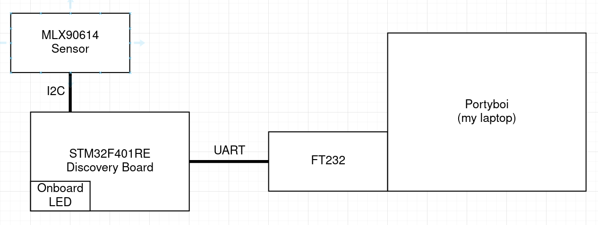
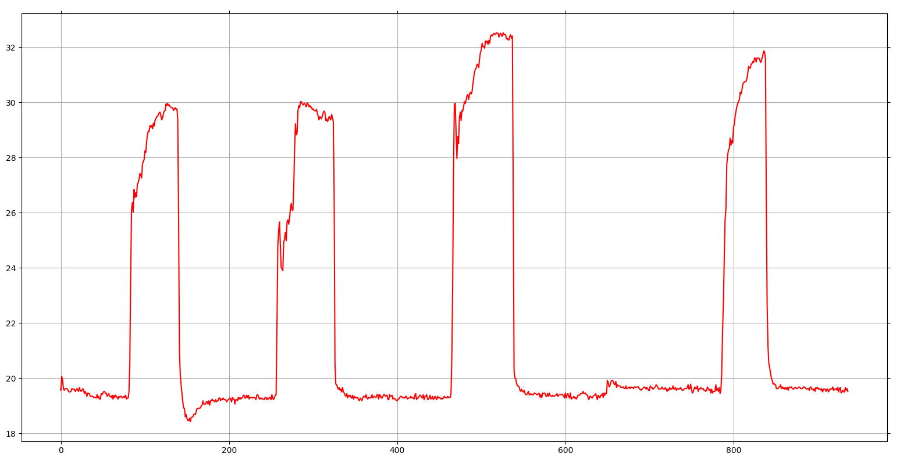

# Temperature Measurement Mini Project

In this mini project, I used the `stm32f4xx_hal` crate to read data from a
`MLX90614` temperature sensor via I2C. The data is then pushed to the UART so
it can be transfered to my laptop via serial using an FTDI adapter. I use a simple python script to connect to the serial device on Linux and plot the live temperature readings via matplotlib.

## Goals: 
- try out the stm32f4xx_hal crate
- learn more rust

## Use Cases
- measure any surface temperatures
- measure without contact to measurement object

## Block Diagram:



## Usage

```
# start openOCD via the connect script in a seperate terminal
./connect.sh

# build and run
cargo run

# this should open gdb-multiarch

# connect to remote target
(gdb) target remote :3333
# load code
(gdb) load
# run
(gdb) continue

# in another terminal start the python script
cd py
python3 plotter.py
```

This opens a window where temperature is plotted in Celsius.




*(got a video about this on my youtube, see link on 0xca7.github.io)*

### 0xca7
